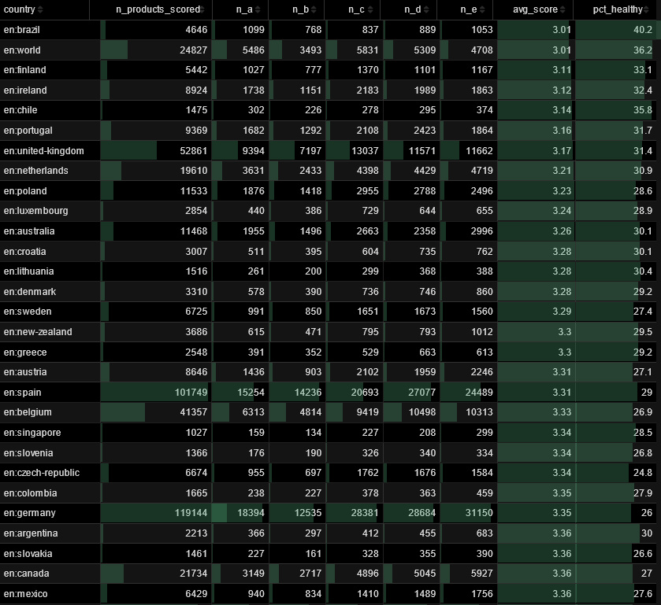
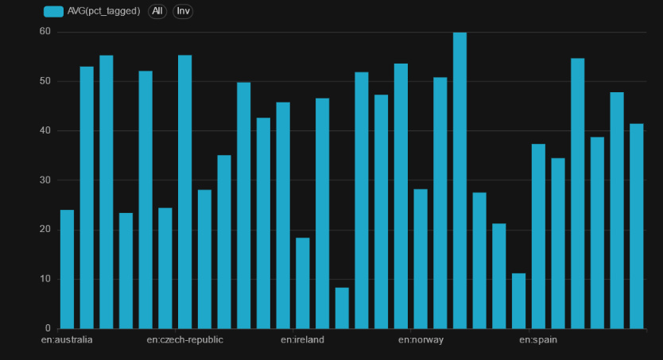

::: {.callout-important appearance="simple"}
🔗 **Dashboard public** :
[sql.openfoodfacts.org/superset/dashboard/p/Dk4w0Y5oAn5/](https://sql.openfoodfacts.org/superset/dashboard/p/Dk4w0Y5oAn5/)
:::

## Ce qu'on a fait

Le brief du défi 5 demandait de **construire un tableau de bord sur Superset**,
l'outil de BI open source utilisé par Open Food Facts
([sql.openfoodfacts.org](https://sql.openfoodfacts.org)). Pour ne pas faire un
dashboard générique de plus, on a choisi d'**aligner Superset sur les
métriques du notebook Quarto** : mêmes questions, mêmes chiffres, deux
audiences différentes.

Concrètement, on a :

1. **Écrit 6 requêtes SQL DuckDB** versionnées dans
   [`sql/`](https://github.com/Manonsigilla/tradukthon-mondiale/tree/main/sql),
   qui reproduisent les métriques A/B/C/D de ce rapport directement sur la
   table `food_products` de sql.openfoodfacts.org
2. **Construit 3 charts** dans Superset à partir de ces requêtes
3. **Assemblé un dashboard public**, ouvert au jury sans création de compte

## L'architecture

```{mermaid}
flowchart LR
    A[Parquet OFF<br/>4 M+ produits] --> B[sql.openfoodfacts.org<br/>DuckDB engine]
    B --> C[6 requêtes SQL<br/>versionnées dans sql/]
    C --> D[Charts Superset]
    D --> E[Dashboard public<br/>partageable au jury / à OFF]
    F[src/metrics.py<br/>Quarto] -.<br/>même logique métier.-> C
```

Les requêtes SQL et le code Python du notebook **produisent exactement les
mêmes chiffres**. Une seule logique métier, deux outils.

## Chart 1 — Classement Nutri-Score par pays

L'exemple direct du brief OFF (« *classement des pays par Nutri-Score ?* »).
Pour chaque pays ayant au moins 1 000 produits scorés, on calcule la
répartition A/B/C/D/E et un score moyen pondéré (A=1, E=5, plus bas = mieux).

Requête : [`sql/06_b1_nutriscore_bonus.sql`](https://github.com/Manonsigilla/tradukthon-mondiale/blob/main/sql/06_b1_nutriscore_bonus.sql)



**Ce que ça raconte** :

| Pays | Produits scorés | Score moyen | % healthy (A/B) |
|---|---:|---:|---:|
| 🥇 Brésil | 4 646 | **3,01** | **40,2 %** |
| 🥈 Finlande | 5 442 | 3,11 | 33,1 % |
| 🥉 Irlande | 8 924 | 3,12 | 32,4 % |
| Portugal | 9 369 | 3,16 | 31,7 % |
| Royaume-Uni | 52 861 | 3,17 | 31,4 % |
| Allemagne | 119 144 | 3,35 | 26,0 % |
| Italie | 91 635 | 3,38 | 26,8 % |

À volume comparable, **les pays nordiques et la péninsule ibérique** affichent
en moyenne de meilleurs Nutri-Scores que l'Europe de l'Ouest. Le **Brésil**
sort en tête sur la part de produits A ou B (40 %), un signal intéressant
pour l'équipe OFF.

## Chart 2 — Taux d'étiquetage par pays (métrique B1)

Combien de produits, dans chaque pays OFF, ont au moins une catégorie
renseignée par les contributeurs ? C'est la version Superset de notre
[métrique B1](02-coverage.qmd) : un signal **communautaire** (pression des
bénévoles locaux), indépendant de la qualité de la taxonomie elle-même.

Requête : [`sql/01_b1_labeling_rate.sql`](https://github.com/Manonsigilla/tradukthon-mondiale/blob/main/sql/01_b1_labeling_rate.sql)



**Ce que ça raconte** : les barres du graphique varient de ~10 % à ~60 %, ce
qui confirme l'écart énorme de **pression communautaire** entre pays. Le top
contient les pays européens à forte communauté (France, Espagne, Allemagne,
Royaume-Uni). En bas, on retrouve les pays où la base OFF existe mais où
peu de contributeurs prennent le temps d'ajouter les catégories.

Le chart est trié par volume de produits par défaut, mais on peut cliquer
sur l'en-tête de colonne `pct_tagged` pour voir directement les pays les
plus / les moins étiquetés.

## Chart 3 — Top catégories utilisées par pays

Pour chaque pays du top 10 OFF (FR, US, DE, ES, IT, UK, BE, CH, NL, PL), on
liste les **30 catégories les plus utilisées** par les produits qui y sont
vendus. C'est un complément à la métrique [D2 du Quarto](03-gaps.qmd) :
plutôt que de regarder les tags **inconnus** par pays, on regarde ici les
tags **connus** dominants.

Requête : [`sql/02_top_categories_by_country.sql`](https://github.com/Manonsigilla/tradukthon-mondiale/blob/main/sql/02_top_categories_by_country.sql)


**Ce que ça raconte** : par exemple pour la **Belgique** (visible dans le
screenshot), les catégories dominantes sont :

| Rang | Catégorie | Produits belges concernés |
|---:|---|---:|
| 1 | `en:plant-based-foods-and-beverages` | 17 219 |
| 2 | `en:snacks` | 7 683 |
| 3 | `en:dairies` | 4 638 |
| 4 | `en:meats-and-their-products` | 4 248 |
| 5 | `en:beverages-and-beverages-preparations` | 2 691 |

On peut filtrer chaque pays dans Superset en cliquant sur la colonne
`country`. Cela donne une vue actionnable pour les contributeurs locaux :
*« voici ce qui est utilisé dans ton pays, concentre tes efforts dessus »*.

## Pourquoi Quarto **et** Superset ?

|  | **Quarto** (ce notebook) | **Superset** (dashboard) |
|---|---|---|
| Public | Data scientists, équipe R&D OFF | Bénévoles OFF, gouvernance |
| Format | Rapport linéaire, pédagogique | Vue tabulaire et graphique, exploratoire |
| Interactivité | Plotly intégré (cf. menu déroulant page [Trous & actions](03-gaps.qmd)) | Tri / filtre par colonne dans chaque chart |
| Évolutivité | Python + Quarto | Drag & drop SQL |
| Partage | `quarto render` → site statique | Lien public, navigateur |

Le notebook **explique la méthodologie** et publie les chiffres clés. Le
dashboard **opérationnalise ces mêmes chiffres** dans l'environnement de
travail quotidien des contributeurs OFF, sans qu'ils aient besoin
d'installer quoi que ce soit.

## Les 3 charts en plus, déjà prêts

Trois requêtes supplémentaires sont versionnées dans
[`sql/`](https://github.com/Manonsigilla/tradukthon-mondiale/tree/main/sql)
pour étendre le dashboard quand on aura le temps :

| # | Requête | Métrique Quarto | Viz Superset visée |
|---|---|---|---|
| 4 | `03_d2_unknown_tag_candidates.sql` | D2 — tags à ajouter | Bar Chart |
| 5 | `04_c_deficit_country_language.sql` | C — déficit pays × langue | Pivot Heatmap |
| 6 | `05_global_completeness_kpi.sql` | KPI complétude | Big Number |

Elles nécessitent de joindre `food_products` avec 3 datasets dérivés de la
taxonomie OFF
([`data/exports/`](https://github.com/Manonsigilla/tradukthon-mondiale/tree/main/data/exports)).
Le script
[`scripts/export_for_superset.py`](https://github.com/Manonsigilla/tradukthon-mondiale/blob/main/scripts/export_for_superset.py)
les produit en local, prêts à être uploadés comme datasets Superset.
